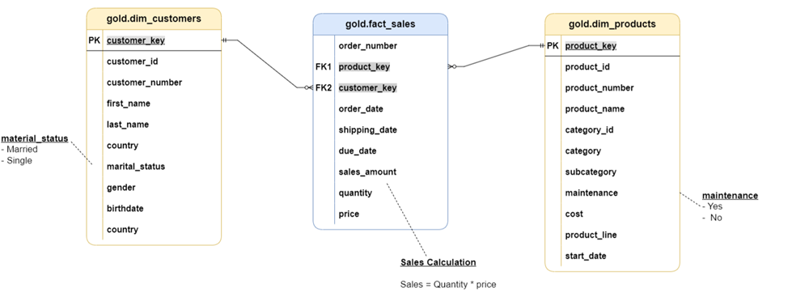
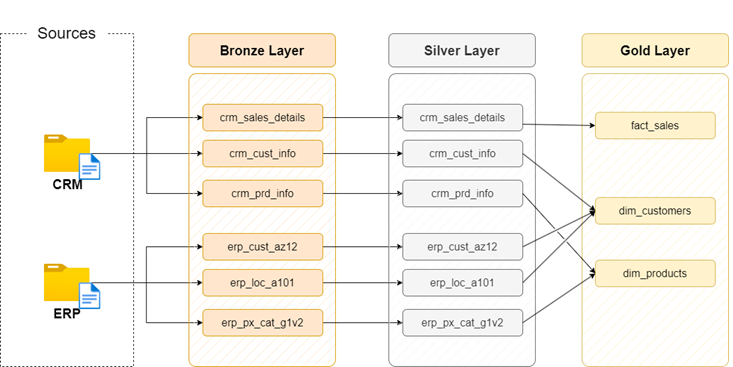

# Modern Data Warehouse in SQL Server with Medallion Architecture

This project demonstrates the implementation of a modern data warehouse using SQL Server, adhering to the Medallion Architecture principles. The primary goal was to consolidate sales data from various source systems (CRM and ERP) to enable analytical reporting and informed decision-making. The architecture focuses on ensuring data quality, consistency, and usability across different layers.

## Architecture Overview

The project leverages the **Medallion Architecture**, a multi-layered approach to data processing, which provides a clear and robust framework from raw data ingestion to business-ready insights.

### Medallion Architecture Layers:

* **Bronze Layer (Raw):** This is the landing zone for raw, unprocessed data directly from source systems. Data is stored "as-is" to ensure traceability and auditability.
* **Silver Layer (Cleaned & Transformed):** This layer holds cleaned, transformed, and integrated data. It's where data quality issues are resolved, duplicates are removed, formats are standardized, and data from different sources is joined.
* **Gold Layer (Aggregated & Business-Ready):** This layer contains aggregated, business-level data optimized for business intelligence, analytics, and reporting. It typically employs a Star Schema for optimal performance and ease of understanding.

## ETL Process

The **Extract, Transform, Load (ETL)** process is the backbone of this data warehouse implementation, moving data through the Medallion layers:

* **Extraction:** Data is identified and extracted from the source systems (CSV files from ERP and CRM). This occurs in the Bronze layer.
* **Transformation:** Extracted data undergoes various manipulations to meet business requirements. This includes data cleansing, data integration, formatting, and normalization. This takes place in the Silver layer.
* **Loading:** The transformed data is finally loaded into the target database tables, typically within the Gold layer.

## Implementation Details

The project ingested data from six CSV files originating from two primary source systems: CRM and ERP. CRM was prioritized in cases of data conflicts.

### Entities Involved:

**CRM System Files:**
* `crm_cust_info` (Customer Information)
* `prd_info` (Product Information)
* `sales_details` (Sales Transactional Records)

**ERP System Files:**
* `CUST_AZ12` (Extra Customer Information - Birthdate)
* `LOC_A101` (Location of Customers - Country)
* `PX_CAT_G1V2` (Product Categories)

### Layer-wise Implementation Highlights:

#### Bronze Layer: Raw Data Ingestion
* Raw data is loaded into `bronze` schema tables, mirroring the source CSV file structure without any transformations.
* SQL Server tables are created dynamically, and data is bulk loaded using `BULK INSERT`.
* A stored procedure (`bronze.load_bronze`) automates this process, incorporating logging and error handling.

#### Silver Layer: Data Cleaning and Transformation
* This layer focuses on resolving data quality issues and integrating data from different sources.
* Each source table underwent specific transformations:
    * **`crm_cust_info` Cleaning:** Handled duplicate and NULL primary keys using `ROW_NUMBER()`, removed unwanted spaces with `TRIM()`, and normalized low-cardinality columns (e.g., marital status, gender) using `CASE` statements.
    * **`crm_prd_info` Cleaning:** Derived `cat_id` and `prd_key` from `prd_key` column for easier joins, handled NULL product costs with `COALESCE()`, and implemented start/end date logic using `LEAD()` for historical records.
    * **`crm_sales_details` Cleaning:** Converted and validated date columns (order, ship, due dates), handling invalid entries by setting them to NULL. Ensured logical consistency for `sls_sales`, `sls_quantity`, and `sls_price`.
* Similar cleaning processes were applied to ERP tables (`erp_cust_az12`, `erp_loc_a101`, `erp_px_cat_g1v2`).
* All silver layer insertions are consolidated into a stored procedure (`silver.load_silver`) for automated execution.

#### Gold Layer: Analytical Data Model
* Designed for optimal analytical performance and ease of understanding for business users.
* A **Star Schema** model was adopted, featuring a central fact table surrounded by dimension tables.
    * **Fact Table:** Contains quantitative information about business events (e.g., sales amount, order quantity).
    * **Dimension Tables:** Provide descriptive context (e.g., customer names, product categories, dates, locations).
* Views were created in the `gold` schema to represent dimension and fact tables, providing logical abstraction without duplicating data.
    * **`gold.dim_customers`:** Integrated customer information from CRM and ERP, reconciled gender columns, and added a `customer_key` surrogate key.
    * **`gold.dim_products`:** Provided descriptive product information, filtering for the latest records, and added a `product_key` surrogate key.
    * **`gold.fact_sales`:** Contained core sales transaction data, linking to dimension tables using their respective surrogate keys.

## Data Model and Flow

**Final Data Model:**

**Complete Data Flow Diagram:**
 

